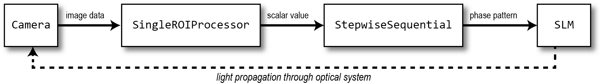

.. _key_concepts:

Key concepts
==================================================

The OpenWFS framework is built around the concept of *devices*. Devices can be *detectors*, which capture, process, or synthesize data, or *actuators*, which change the state of the system. The framework provides a common interface for working with detectors and actuators, and for synchronizing their operations.

In addition, OpenWFS maintains metadata and units for all data arrays and properties where relevant. This approach reduces the chance of errors caused by passing a quantity in incorrect units, and to simplify the computation of coordinates (see :numref:`Units and metadata`).

Detectors
------------
Detectors in OpenWFS are objects that capture, generate, or process data. All detectors derive from the :class:`~.Detector` base class. A Detector object may correspond to a physical device such as a camera, or it may be a software component that generates synthetic data (see :numref:`section-simulations`). Detectors have the following properties and methods:

.. code-block:: python

    class Detector(Device):

        # starting a measurement
        def read(self) -> np.ndarray
        def trigger(self, out: Optional[np.ndarray] = None) -> Future

        # metadata
        data_shape: tuple[int, ...]
        pixel_size: Optional[Quantity]
        extent: Quantity
        def coordinates(dimension: int) -> Quantity

The :meth:`~.Detector.read()` method of a detector starts a measurement and returns the captured data. It triggers the detector and blocks until the data is available. Data is always returned as `numpy` array :cite:`numpy`. Subclasses of :class:`~.Detector` typically add properties specific to that detector (e.g. shutter time, gain, etc.). In the simplest case, setting these properties and calling :meth:`.~Detector.read()` is all that is needed to capture data. The :meth:`~.Detector.trigger()` method is used for asynchronous measurements as described below. All other properties and methods are used for metadata and units, as described in :numref:`Units and metadata`.

The detector object inherits some properties and methods from the base class :class:`~.Device`. These are used by the synchronization mechanism to determine when it is safe to start a measurement, as described in :numref:`device-synchronization`.

Asynchronous measurements
+++++++++++++++++++++++++++
:meth:`.~Detector.read()` blocks the program until the captured data is available. This behavior is not ideal when multiple detectors are used simultaneously, or when transferring or processing the data takes a long time. In these cases, it is preferable to use :meth:`.~Detector.trigger()`, which initiates the process of capturing or generating data and returns directly. The program can continue operation while the data is being captured/transferred/generated in a worker thread. While fetching and processing data is underway, any attempt to modify a property of the detector will block until the fetching and processing is complete. This way, all properties (such as the region of interest) are guaranteed to be constant between the calls to :meth:`.~Detector.trigger` and the moment the data is actually fetched and processed in the worker thread.

The asynchronous measurement mechanism can be seen in action in the `StepwiseSequential` algorithm used in :numref:`hello-wfs`. The `execute()` function of this algorithm is implemented as

.. code-block:: python

    def execute(self) -> WFSResult:
        phase_pattern = np.zeros((self.n_y, self.n_x), 'float32')
        measurements = np.zeros((self.n_y, self.n_x, self.phase_steps, *self.feedback.data_shape))

        for y in range(self.n_y):
            for x in range(self.n_x):
                for p in range(self.phase_steps):
                    phase_pattern[y, x] = p * 2 * np.pi / self.phase_steps
                    self.slm.set_phases(phase_pattern)
                    self.feedback.trigger(out=measurements[y, x, p, ...])
                phase_pattern[y, x] = 0

        self.feedback.wait()
        return analyze_phase_stepping(measurements, axis=2)

This code performs a wavefront shaping algorithm similar to the one described in :cite:`Vellekoop2007`. In this version, there is no pre-optimization. It works by cycling the phase of each of the n_x × n_y segments on the SLM between 0 and 2π, and measuring the feedback signal at each step. `self.feedback` holds a `Detector` object that is triggered, and stores the measurement in a pre-allocated `measurements` array when it becomes available. It is possible to find the optimized wavefront for multiple targets simultaneously by using a detector that returns an array of size `feedback.data_shape`, which contains a feedback value for each of the targets.

The program does not wait for the data to become available and can directly proceed with preparing the next pattern to send to the SLM (also see :numref:`device-synchronization`). After running the algorithm, `wait` is called to wait until all measurement data is stored in the `measurements` array, and the utility function `analyze_phase_stepping` is used to extract the transmission matrix from the measurements, as well as a series of troubleshooting statistics (see :numref:`Analysis and troubleshooting`).

Note that, except for this asynchronous mechanism for fetching and processing data, OpenWFS is not designed to be thread-safe, and the user is responsible for guaranteeing that devices are only accessed from a single thread at a time.

.. _hellowfsdiagram:

    Flowchart of the ``hello_wfs.py`` example.

Processors
------------
A `Processor` is a `Detector` that takes input from one or more other detectors, and combines/processes this data. We already encountered an example in :numref:`Getting started`, where the `SingleRoiProcessor` was used to average the data from a camera over a region of interest. A block diagram of the data flow of this code is shown in :numref:`hellowfsdiagram`. Since a processor, itself, is a `Detector`, multiple processors can be chained together to combine their functionality. The OpenWFS further includes various processors, such as a `CropProcessor` to crop data to a rectangular region of interest, and a `TransformProcessor` to perform affine image transformations to image produced by a source.

Actuators
---------
Actuators are devices that *move* things in the setup. This can be literal, such as moving a translation stage, or a virtual movement, like an SLM that takes time to switch to a different phase pattern. All actuators are derived from the common :class:`.Actuator` base class. Actuators have no additional methods or properties other than those in the :class:`.Device` base class.

Units and metadata
----------------------------------
OpenWFS consistently uses `astropy.units` :cite:`astropy` for quantities with physical dimensions, which allows for calculations to be performed with correct units, and for automatic unit conversion where necessary. Importantly, it prevents errors caused by passing a quantity in incorrect units, such as passing a wavelength in micrometers when the function expects a wavelength in nanometers. By using `astropy.units`, the quantities are converted automatically, so one may for example specify a time in milliseconds, minutes or days. The use of units is illustrated in the following snippet:

.. code-block:: python

    import astropy.units as u
    c = Camera()
    c.shutter_time = 10 * u.ms
    c.shutter_time = 0.01 * u.s  # equivalent to the previous line
    c.shutter_time = 10 # raises an error, since the unit is missing

In addition, OpenWFS allows attaching pixel-size metadata to data arrays using the functions :func:`~.set_pixel_size()`. Pixel sizes can represent a physical length (e.g. as in the size pixels on an image sensor), or other units such as time (e.g. as the sampling period in a time series). OpenWFS fully supports anisotropic pixels, where the pixel sizes in the x and y directions are different.

The data arrays returned by the :meth:`~.Detector.read()` function of a detector have `pixel_size` metadata attached whenever appropriate. The pixel size can be retrieved from the array using  :func:`~.get_pixel_size()`, or obtained from the  :attr:`~.Detector.pixel_size` attribute directly. As an alternative to accessing the pixel size directly, :func:`~get_extent()` and :class:`~.Detector.extent` provide access to the extent of the array, which is always equal to the pixel size times the shape of the array. Finally, the convenience function :meth:`~.Detector.coordinates` returns a vector of coordinates with appropriate units along a specified dimension of the array.

.. _device-synchronization:

Synchronization
---------------
When running an experiment, it is essential to synchronize detectors and actuators. For example, starting an acquisition on a camera while the spatial light modulator (SLM) is still switching to a new phase pattern will result in an incorrect measurement. Similarly, moving a translation stage while the camera is still acquiring data will result in a blurred image. OpenWFS provides fully automatic synchronization between different devices, so that there is no need for manual synchronization code or ``sleep`` statements.

The :class:`~.Device` base class implements a set of properties and methods to implement the synchronization mechanism:

.. code-block:: python

    class Device:
        def busy(self) -> bool
        def wait(self, up_to: Optional[Quantity[u.ms]] = None)

        duration: Quantity[u.ms]
        latency: Quantity[u.ms]
        timeout: Quantity[u.ms]

Each device can either be *busy* or *ready*, and this state can be polled by calling :meth:`~.Device.busy()`. Detectors are busy as long as the detector hardware is measuring.  Actuators are busy when they are moving, about to move, or settling after movement. OpenWFS automatically enforces two conditions:

- before starting a measurement, wait until all motion is (almost) completed
- before starting any movement, wait until all measurements are (almost) completed

Here, 'almost' refers to the fact that devices may have a *latency*. Latency is the time between sending a command to a device, and the moment the device starts responding. An important example is the SLM, which typically takes one or two frame periods to transfer the image data to the liquid crystal chip. Such devices can specify a non-zero `latency` attribute. When specified, the device 'promises' not to do anything until `latency` milliseconds after the start of the measurement or movement. When a latency is specified, detectors or actuators can be started slightly before the devices of the other type (actuators or detectors, respectively) have finished their operation. For example, this mechanism allows sending a new frame to the SLM *before* the measurements of the current frame are finished, since it is known that the SLM will not respond for `latency` milliseconds anyway. This way, measurements and SLM updates can be pipelined to maximize the number of measurements that can be done in a certain amount of time. To enable these pipelined measurements, the `Device` class also provides a `duration` attribute, which is the maximum time interval between the start and end of a measurement or actuator action.

This synchronization is performed automatically. If desired, it is possible to explicitly wait for the device to become ready by calling :meth:`~.Device.wait()`. To accommodate taking into account the latency, this function takes an optional parameter `up_to`, which indicates that the function may return the specified time *before* the device hardware is ready. In user code, it is only necessary to call `wait` when using the `out` parameter to store measurements in a pre-defined location (see :numref:`Asynchronous measurements` above). A typical usage pattern is illustrated in the following snippet:

.. code-block:: python

    frames1 = np.zeros((P, *cam1.data_shape))
    frames2 = np.zeros((P, *cam2.data_shape))
    for p in range(P)
        # wait for all measurements to complete (up to the latency of the slm)
        # then send the new pattern to the SLM hardware
        slm.set_phases(phase * 2 * np.pi / P)

        # wait for the image on the SLM to stabilize, then trigger the measurement.
        cam1.trigger(out = frames1[n, p, ...])

        # directly trigger cam2, since we already are in the 'measuring' state.
        cam2.trigger(out = frames2[n, p, ...])

    cam1.wait() # wait until camera 1 is done grabbing frames
    cam2.wait() # wait until camera 2 is done grabbing frames

Finally, devices have a `timeout` attribute, which is the maximum time to wait for a device to become ready. This timeout is used in the state-switching mechanism, and when explicitly waiting for results using :meth:`~.Device.wait()` or  :meth:`~.Device.read()`.

Currently available devices
----------------------------

The following devices are currently implemented in OpenWFS:

.. list-table::
   :header-rows: 1

   * - Device Name
     - Device Type
     - Description
   * - Camera
     - Detector
     - Adapter for GenICam/GenTL cameras
   * - ScanningMicroscope
     - Detector
     - Laser scanning microscope using galvo mirrors and NI DAQ
   * - StaticSource
     - Detector
     - Returns pre-set data, simulating a static source
   * - NoiseSource
     - Detector
     - Generates uniform or Gaussian noise as a source
   * - SingleRoi
     - Processor (Detector)
     - Averages signal over a single ROI
   * - MultipleRoi
     - Processor (Detector)
     - Averages signals over multiple regions of interest (ROIs)
   * - CropProcessor
     - Processor (Detector)
     - Crops data from the source to a region of interest
   * - TransformProcessor
     - Processor (Detector)
     - Performs affine transformations on the source data
   * - ADCProcessor
     - Processor (Detector)
     - Simulates an analog-digital converter
   * - SimulatedWFS
     - Processor
     - Simulates wavefront shaping experiment using Fourier transform-based intensity computation at the focal plane
   * - Gain
     - Actuator
     - Controls PMT gain voltage using NI data acquisition card
   * - PhaseSLM
     - Actuator
     - Simulates a phase-only spatial light modulator
   * - SLM
     - Actuator
     - Controls and renders patterns on a Spatial Light Modulator (SLM) using OpenGL
     
Available Algorithms
---------------------

The following algorithms are available in OpenWFS for wavefront shaping:

.. list-table::
   :header-rows: 1

   * - Algorithm Name
     - Description
   * - FourierDualReference
     - A Fourier dual reference algorithm that uses plane waves from a disk in k-space for wavefront shaping :cite:`Mastiani2022`.
   * - IterativeDualReference
     - A generic iterative dual reference algorithm with the ability to use custom basis functions for non-linear feedback applications.
   * - DualReference
     - A generic dual reference algorithm with the option for optimized reference, suitable for multi-target optimization and iterative feedback.
   * - SimpleGenetic
     - A simple genetic algorithm that optimizes wavefronts by selecting elite individuals and introducing mutations for focusing through scattering media :cite:`Piestun2012`.
   * - StepwiseSequential
     - A stepwise sequential algorithm which systematically modifies the phase pattern of each SLM element :cite:`Vellekoop2007`.