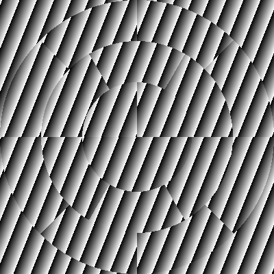

.. _section-slms:

Spatial Light Modulators
==============================
Spatial Light Modulators are the heart of any wavefront shaping experiment. Currently, OpenWFS supports the use of phase-only spatial light modulators through the following simple interface:

.. code-block:: python

    class PhaseSLM(ABC):
        def set_phases(self, values: ArrayLike, update: bool = True)
        def update(self)

The :meth:`~.PhaseSLM.set_phases()` method takes a scalar or a 2-D array of phase values in radians, which is wrapped to the range [0, 2π) and displayed on the SLM. This function calls :meth:`~.PhaseSLM.update()` by default to send the image to the SLM hardware. In more advanced scenarios, like texture blending (see below), it can be useful to postpone the update by passing ``update=False`` and manually cal :meth:`~.PhaseSLM.update()` later. The algorithms in OpenWFS only access SLMs through this simple interface. As a result, the details of the SLM hardware are decoupled from the wavefront shaping algorithm itself.

Currently, there are two implementations of the `PhaseSLM` interface. The :class:`simulation.SLM` is used for simulating experiments and for testing algorithms (see :numref:`section-simulations`).  The :class:`hardware.SLM` is an OpenGL-accelerated controller for using a phase-only SLM that is connected to the video output of a computer. The SLM can be created in windowed mode (useful for debugging), or full screen. It is possible to have multiple windowed SLMs on the same monitor, but only one full-screen SLM per monitor. In addition, the SLM implements some advanced features that are discussed below.

Texture mapping and blending
-----------------------------------

.. _slmdemo:

    Sample output of the SLM object, generated by the script ``examples/slm_disk.py``. Here, two patches were used: a circular one with large segments in concentric rings, and a second one showing a superposed phase gradient.

On top of the basic functionality, the :class:`hardware.SLM` object provides advanced functionality for controlling how the pixels in the phase map are mapped to the screen. An SLM object holds one or more :class:`~.Patch` objects that correspond to shapes that are drawn on the screen. Each patch holds a 2-D array of phase values, which stored as a texture on the graphics card. The user is completely free to define the shape of the patch, and the mapping between the phase values and the screen coordinates.  In the simplest form, the texture is just scaled to fit a square region on the screen. However, arbitrary mappings are possible, allowing textures to be warped (e. g., to compensate for barrel distortion aberrations), or even mapped to a completely different shape, such as a disk or ring, as can be seen in :numref:`slmdemo`.

If an SLM holds multiple patches, the patches are drawn in the order they are present in the :attr:`~.slm.SLM.patches` list. If patches overlap, the pixels of the previous patch are either overwritten (when the :attr:`~.Patch.additive_blend` property of the patch is ``False``), or added to the phase values of the previous patch (when :attr:`~.Patch.additive_blend` is ``True``).

This way, a large range of use cases is enabled, including:

    - Drawing a single square patch with a single texture (the default).
    - Mapping the phase values to a disk, with an effective resolution depending on the distance to the center
      of the disk.
    - Applying an additive patch (an 'offset layer') that corrects for system aberrations.

.. _slmcode:
.. literalinclude:: ../../examples/slm_disk.py
    :language: python
    :caption: ``slm_disk``. Illustration of texture warping and blending functionality of the :class:`hardware.SLM` object.

The code that was used to create :numref:`slmdemo` is shown in :numref:`slmcode`. The SLM object is constructed with two patches. The first patch holds an array of 18 random values which are mapped to three concentric rings, consisting of 4, 6, and 8 segments, respectively. Such an approach can be useful for equalizing the contribution of different segments on the SLM :cite:`mastiani2021noise`. Superposed onto this image is a linear gradient, which may be used to steer the light coming from the SLM. The `SLM` object  takes care of mapping, blending, and phase wrapping the phase patterns in real-time.

The code also showcases the use of the :attr:`~.slm.SLM.pixels` attribute, which holds a holds a virtual camera that reads the gray values of the pixels currently displayed on the SLM. This virtual camera implements the :class:`~.Detector` interface, meaning that it can be used just like an actual camera.

Lookup table
---------------------------------------

Even though the SLM hardware itself often includes a hardware lookup table, there usually is no standard way to set it from Python, making switching between lookup tables cumbersome. The OpenGL-accelerated lookup table in the SLM object provides a solution to this problem, which is especially useful when working with tunable lasers, for which the lookup table needs to be adjusted often. The SLM object has a :attr:`~.slm.SLM.lookup_table` property, which holds a table that is used to convert phase values from radians to gray values on the screen. By default, this table is set to `range(256)`, meaning that a phase of 0 produces a gray value of 0, and a phase of  255/256·2π produces a gray value of 255. A phase of 2π again produces a gray value of 0.

.. _slm-synchronization:

Synchronization
------------------------------------

When working with an SLM that is connected to a video output, it is essential to synchronize with the vertical retrace of the graphics card. 'Vertical retrace' is the historical name for the start of a new frame. The software should update the image on the screen only during this vertical retrace. If the image is changed between vertical retraces, *tearing* will occur, meaning that the SLM will show part of the old frame and part of the new frame simultaneously. The :class:`~.hardware.SLM` object uses OpenGL to synchronize to the vertical retrace of the graphics port. It uses the standard technique to avoid tearing: when updating the SLM, the image is first written to an invisible back buffer, which is swapped with the visible front buffer during the vertical retrace event.
