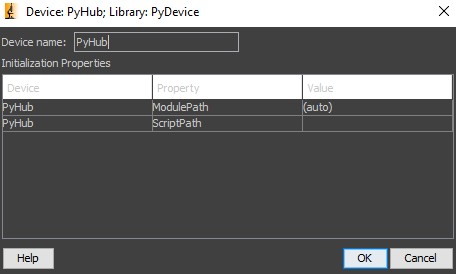
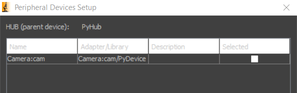
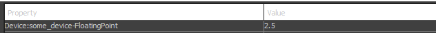
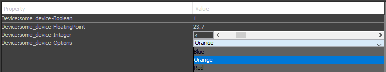

## Summary

<table>
<tr>
<td markdown="1">

**Summary:**

</td>
<td markdown="1">

Device adapter for control of Python objects in MicroManager

</td>
</tr>
<tr>
<td markdown="1">

**Author:**

</td>
<td markdown="1">

Ivo Vellekoop and Jeroen Doornbos

</td>
</tr>
<tr>
<td markdown="1">

**License:**

</td>
<td markdown="1">

BSD-3

</td>
</tr>
<tr>
<td markdown="1">

**Devices:**

</td>
<td markdown="1">

Stage, XYStage, Camera, Generic device

</td>
</tr>
</table>


# How it works

PyDevice is an adapter that allows MicroManager to use Python objects as devices. This allows you to develop devices swiftly and expose them to users directly, with only minimal Python skills necessary.


The PyDevice runs its own Python instance, and exposes the objects to MicroManager.
This is done by recognising certain structures in the Python code, and transforming them to the required MicroManager objects.


# Documentation & examples
Examples of these objects can be found in:

- https://github.com/micro-manager/mmCoreAndDevices/tree/main/DeviceAdapters/PyDevice, this contains simple example devices that show the requirements of the Python objects. It also contains bootstrap.py; the script that reads and recognizes specific types of devices.

- https://github.com/IvoVellekoop/openwfs/tree/master/openwfs/devices, A more extensive repository containing the simple examples and actual implementations, like a laser scanning object.

    it can soon also be installed & imported as the PyPI package OpenWFS:

        pip install OpenWFS
    
    and for use:
    
        from OpenWFS.devices.example_camera import Camera
        devices = {'cam': Camera()}
    
# Using existing devices
If you want to configure a device which has been developed already, you select PyDevice in the configuration manager. This will open the following screen:



ModulePath signifies which Python install the PyDevice will use as its interpreter. It will automatically find a Python install found in the system environment variables (PATH). Virtual environments require different ModulePaths. This is important: this determines which packages are available to the Python interpreter. By leaving it on auto, it will automatically detect if the loaded script is in a virtual environment, and if one is found, sets it as the ModulePath.

ScriptPath is the path to the script that contains the devices. It cannot be any .py file; more on the requirements for making devices in the next chapter *Developing new components*. In the case for the example_camera shown in the previous chapter, the following screen will show:



Which can be selected and used as the camera.

# Developing new components:

In order to expose a device in Python to MicroManager, 4 things need to be considered:

## **1.** *Make your device available with the 'devices' dict object.*

When loading the .py in the initialization of the device, the .py is run. If this file produces a dictionary object called devices, it will make all the objects in this dict available to micromanager. For example:
    
    devices = {'cam': Camera()}
    
Will result in the creation of an object called cam in MicroManager, linked to the Camera object in Python. Loading multiple devices is done by adding more entries in the dict object:

    devices = {'cam': Camera(),'stage': XYStage()}

Of course, the devices need to be declared somewhere in the file as well. A completer example would be:
    
    class GenericDevice:

        def __init__(self,floating_point):
            self._floating_point = floating_point
        
    devices = {'some_device': GenericDevice(2.5)}
    

## **2.** *Make properties available using @property and @name.setter decorators*

Declaring devices makes PyDevice recognize the objects, but not necessarily its properties. 
Properties of objects are recognised with @property and @name.setter decorators. For example:

    class GenericDevice:

        def __init__(self,floating_point):
            self._floating_point = floating_point
            
        @property
        def floating_point(self) -> float:
            return self._floating_point
    
        @floating_point.setter
        def floating_point(self, value):
            self._floating_point = value

        
    devices = {'some_device': GenericDevice(2.5)}
    
Will appear as such in MicroManager:



As can be seen here, the naming conventions will also be adapted. Properties that follow the snake_case convention will be transformed into CamelCase.

## **3.** *Signify property type using type hints*


Type hints in Python are not just annotations but are crucial for ensuring that MicroManager receives the correct property information for Python objects. Here's a detailed breakdown of how type hints are used in the example provided:

- **Enum Type Hint:**

  ```python
  from enum import Enum

  class SomeOptions(Enum):
      Orange = 1
      Red = 2
      Blue = 3

  @property
  def options(self) -> SomeOptions:
      return self._options

  @options.setter
  def options(self, value):
      self._options = value
  ```

  This `Enum` type hint specifies that the `options` property can only take values defined in the `SomeOptions` enumeration. This restriction guarantees that users can only set `options` to either `Orange`, `Red`, or `Blue`, enhancing the predictability and safety of the device's operation.

- **Float Type Hint:**

  ```python
  @property
  def floating_point(self) -> float:
      return self._floating_point

  @floating_point.setter
  def floating_point(self, value):
      self._floating_point = value
  ```

  The `-> float` type hint indicates that the `floating_point` property is a floating-point number. It ensures that any value assigned to this property in MicroManager is a valid float, preventing type mismatch errors.

- **Boolean Type Hint:**

  ```python
  @property
  def boolean(self) -> bool:
      return self._boolean

  @boolean.setter
  def boolean(self, value: bool):
      self._boolean = value
  ```

  Here, `-> bool` enforces that the `boolean` property is a boolean value. This clarity is vital for properties that are meant to represent binary states (true/false), ensuring correct and expected behavior.

- **Annotated Integer Type Hint:**

  ```python
  from typing import Annotated

  @property
  def integer(self) -> Annotated[int, {'min': 0, 'max': 42}]:
      return self._integer

  @integer.setter
  def integer(self, value):
      self._integer = value
  ```

  `Annotated[int, {'min': 0, 'max': 42}]` goes beyond a simple integer type hint by specifying a range. This annotation tells MicroManager that `integer` is not just any integer but must fall within the specified range (0 to 42). It's particularly useful for setting safety limits on device properties to prevent hardware damage or other errors.

    Combining these property in an example device, produces this in MicroManager:

    

- **Astropy Unit Type Hint:**

  Using astropy's `Quantity` type hint allows for precise management of physical quantities in Python, which is especially useful for devices requiring accurate unit measurements. For example:

  ```
  from astropy.units import Quantity, Unit
  import astropy.units as u

  class SomeDevice:
      def __init__(self):
          self._measurement_time = 100 * u.ms

      @property
      def measurement_time(self) -> Quantity[u.ms]:
          return self._measurement_time

      @measurement_time.setter
      def measurement_time(self, value: Unit):
          self._measurement_time = value.to(u.ms)
    ```
    In this example, the measurement_time property is defined with an astropy unit, Quantity[u.ms], ensuring that this property is always treated as a time quantity in milliseconds. Using value.to(u.ms) for the setter method converts any compatible unit to milliseconds, maintaining unit consistency and accuracy.

- **Initialisation:**

    Setting default values in the Python class in the `__init__` declaration will set the default during the initialisation of the MicroManager device.
   MicroManager does not support `None` values, but they may be useful to indicate that a parameter is not set. As a workaround for floating point properties, a `None` in Python is converted to a `nan` in MicroManager, and vice-versa.

In summary, these type hints, along with the Python structures used (like `Enum` and `Annotated`), provide a powerful way to control and validate the data that flows between Python objects and MicroManager. This level of detail in specifying property types is critical for creating robust, reliable, and easy-to-use devices in the MicroManager ecosystem.

## **4.** *Specific device templates*

Some devices in MicroManager have specific functionality and requirements. A camera, for example, needs to have methods to obtain or create an image. PyDevice checks if the required properties and methods are found in each object it encounters and labels them if any template matches. Currently, the supported device types are:

1. Device
2. Camera
3. Stage
4. XYStage

Examples of each implementation exists in the documentation folders. The file containing the templates is bootstrap.py, so for more detail; check this file.

**1. Device**
This is the default device type, if none of the requirements for a specific device are met, the device type will be set to this.

**2. Camera**
Required properties:

    data_shape: tuple[int]
    measurement_time: Quantity[u.ms]
    top: int
    left: int
    height: int
    width: int
Required methods:

    trigger(self) -> None
    read(self) -> np.ndarray()
    
**Important note:** The read method needs to return a uint16 type array. Check OpenWFS for analogue-to-digital converters, or force the data type yourself.


**3. Stage**
Required properties:

    step_size: Quantity[u.um]
    position: Quantity[u.um]
Required methods:

    home(self) -> None
    wait(self) -> None

**4. XYStage**
Required properties:

    x: Quantity[u.um]
    y: Quantity[u.um]
    step_size_x: Quantity[u.um]
    step_size_y: Quantity[u.um]
Required methods:

    home(self) -> None
    wait(self) -> None

# Existing devices repository

Ideally, we would like to set up a database containing implementations. All current devices are included in the OpenWFS repository. If you would like to contribute; please contact i.m.vellekoop@utwente.nl, open an issue on the MicroManager or OpenWFS repositories or open a topic on https://forum.image.sc.